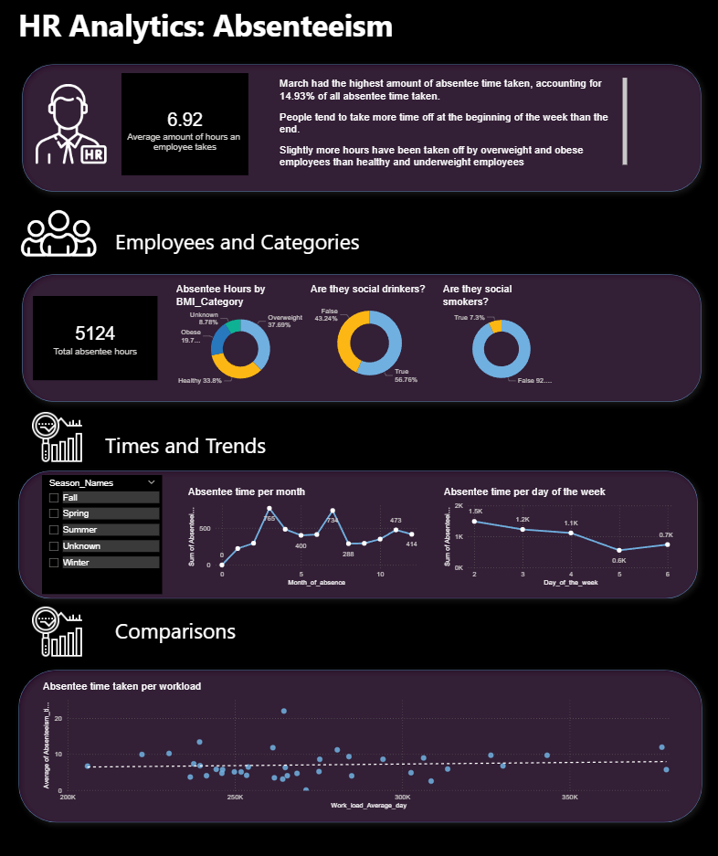

# HR-health-bonus-dashboard
End-to-End SQL dashboard based on dataset of absentee data for employees.

The following request was given:
1.) Provide a list of employees that are healthy and have low absenteeism 
2.) Calculate a wage increase for non-smokers with a budget of $983,221
3.) Create a dashboard for HR to understand Absenteeism at work based on an approved wireframe

Approach:

For item one, I strategically increased the standards for "healthy" that would leave a noticable and enviable bonus for the employees affected. I excluded all "social" smokers and drinkers (there likely wasn't an option listed for those that consume these things privately), then filtered by employees with a BMI strictly below the national average of 25, and have less absentee hours than the average amount of absentee hours per employee within the company. 

For item two, I simply divided the amount of budget listed by the amount of non-smokers in the company. 

For item three, I imported the data into PowerBI (my preferred program for non-geographic data).

Key findings include: 
* There are 111 employees eligible for our healthy bonus program
* From a budget of $983,221, we are able to give non-smoking employees a wage increase of $1414.4 a year
* March had the highest amount of absentee time taken, accounting for 14.93% of all absentee time taken.
* People tend to take more time off at the beginning of the week than the end.
* Slightly more hours have been taken off by overweight and obese employees than healthy and underweight employees